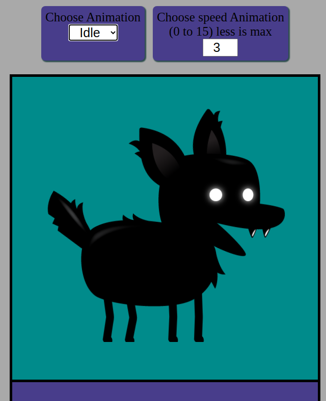

# Sprite-animation-training
** Use CTRL/CLIC or **Middle mouse button** for BLANK TAB **
  
[Result here](https://henriteinturier.github.io/Sprite-animation-training/)
 
### learning in this training:
* Canvas HTML
* Use Spreadsheet for sprites
* getContext('2d')
* drawImage
* requestAnimationsFrame
* forEach
* technique to manage animation speed
 

